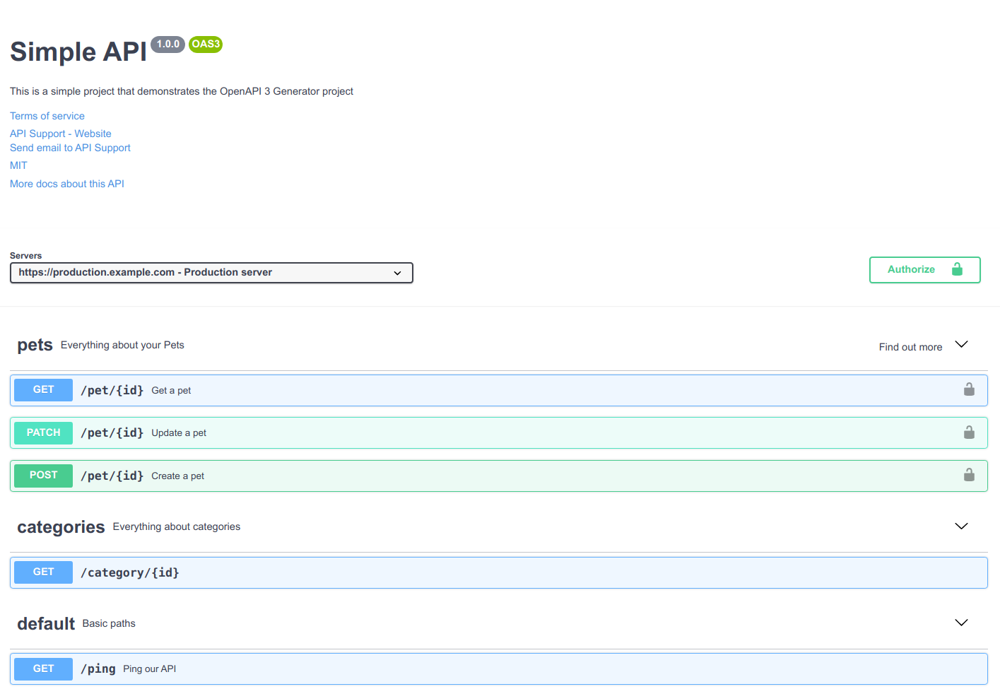

# OpenAPI 3 Generator

The goal of this project is to create a generator that conveniently creates
API definitions in the OpenAPI 3 format using [marshmallow](https://marshmallow.readthedocs.io/) classes
and saves them into a YAML file.

You can think this project as programmable API definitions/documentation for your API (your API can be written in any language, not only in Python).

Python is used here just for convenience of describing classes and has less code yet strong typing.

Then you can inject the generated YAML file with Swagger UI to any project (just a page that renders
Swagger UI HTML code which requests the generated YAML file).

#### Why I made the project

I was developing a project in PHP using this library [php-swagger](https://github.com/zircote/swagger-php). It
has ability to describe an API using annotations in docstrings of classes/methods (you can find alternative
projects for your programming language, the idea behind is to describe API's definitions something near the code: 
routes, paths, views, etc).

But this method has some problems to me:

- I couldn't describe the API's definitions as real code when the interpreter/compiler could fix my issues
with schemas/paths
- I had issues with spaces in docstrings and it looked ugly and messy
- I wanted to have versioned pages of my API (i.e.: v1.0, v1.1, v1.2)
- I wanted to make validation of the resulted API definitions after writing it

### What does the project do?

- Generates a YAML file of your API with paths, schemes, requests, security methods in the [OpenAPI 3](https://swagger.io/specification/) format
- Runs a Flask web server for prototyping (Flask is used only for development purposes, it is not meant here to
create an API using Flask, but you can do it as well)

### Structure of the project

- `config.py` : basic information about the API (title, description, support contacts, servers, tags info and etc)
- `swagger_ui.py` : a Flask web server for prototyping
- `build.py` : a build script to create the `api.yaml` file
- `api/paths` : your API paths
- `api/requests` : your API requests
- `api/schemas` : your API schemas for responses and request bodies
- `api/project.py` : here you add your classes of schemas, requests and paths

### Requirements

Tools:

- Python 3.7
- [pipenv](https://docs.pipenv.org)

Knowledge in:

- Swagger
- Python
- YAML format

## How to use?

Just fork or copy this project to your computer using git:

```
git clone https://github.com/egorsmkv/openapi3-generator.git
cd openapi3-generator
```

After the cloning, initialize the environment:

```bash
# install all dependencies
pipenv install

# enter the environment
pipenv shell
```

### One-time mode

To create an `api.yaml` file with your API definitions in the OpenAPI 3 format:

```bash
# create an api.yaml file
python build.py
```

### Prototyping mode

If you are prototyping your API then you can run a Flask web server with pre-defined Swagger UI using [GNU make](https://www.gnu.org/software/make/) and start
to create your API by editing schemas, paths and other objects.

The web server is running in **debug mode**, it will reload the app each time when you change something
in the project and after any change you can just refresh a page to see new version your API definitions in Swagger UI.

```bash
make run

# * Running on http://127.0.0.1:8060/ (Press CTRL+C to quit)
# * Restarting with stat
# * Debugger is active!
```

If you don't have GNU make, use the following commands:

```bash
export FLASK_APP="swagger_ui.py"
export FLASK_ENV="development"

python -m flask run --port=8060
```

You can find the Swagger UI page on http://127.0.0.1:8060 in your browser.

## Demo


 